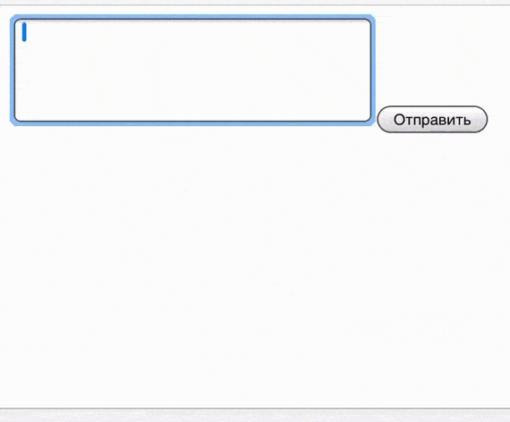

# Rockstone (тестовое задание)


# Инструкция по запуску:
1. ```npm i``` в корневой папке проекта.
2. ```npm start``` в корневой папке проекта.
3. На телефоне (планшете) введите адрес http://192.168.1.180:3000/
